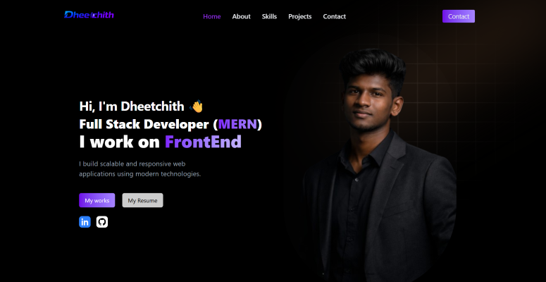

# 👋 Hi, I'm Dheetchith Selvan 

## 🧠 About Me
 

💻 MERN Stack Developer specializing in full-stack application development.  
⚡ Focused on clean UI, backend architecture, and API design.  
🎯 Open to internship and entry-level opportunities.

 

## 🛠️ Skills & Tools

### 💻 Skills

### 🧰 Tools

## 🚀 Projects
 

<table>
<tr>

<td width="50%" valign="top">

### 💰 Income Expense Tracker

Lightweight full-stack MERN app to track income, expenses, and balance in real-time.

<b>Stack:</b> MongoDB • Express • React • Node

<a href="https://github.com/dheetchithselvan12/dheetchith-portfolio">🔗 Code</a> |
<a href="https://dheetchithselvan12.github.io/dheetchith-portfolio/">🌐 Live</a>

</td>

<td width="50%" valign="top">

### 🌐 Personal Portfolio

Responsive portfolio website with modern UI and project showcase.

<b>Stack:</b> React • CSS • JavaScript

<a href="https://github.com/dheetchithselvan12/dheetchith-portfolio">🔗 Code</a> |
<a href="https://dheetchithselvan12.github.io/dheetchith-portfolio/">🌐 Live</a>

</td>

</tr>
</table>

## 📊 GitHub Stats
 

  
  

  

 

## 🐍 Contribution Activity
 

<picture>
  <source media="(prefers-color-scheme: dark)" 
          srcset="https://raw.githubusercontent.com/dheetchithselvan12/dheetchithselvan12/output/github-contribution-grid-snake-dark.svg">
  
</picture>

 

## 📫 Contact 

 

&nbsp;&nbsp;

&nbsp;&nbsp;

&nbsp;&nbsp;

 

  

⭐ If you like my work, consider giving a star to my repositories!

